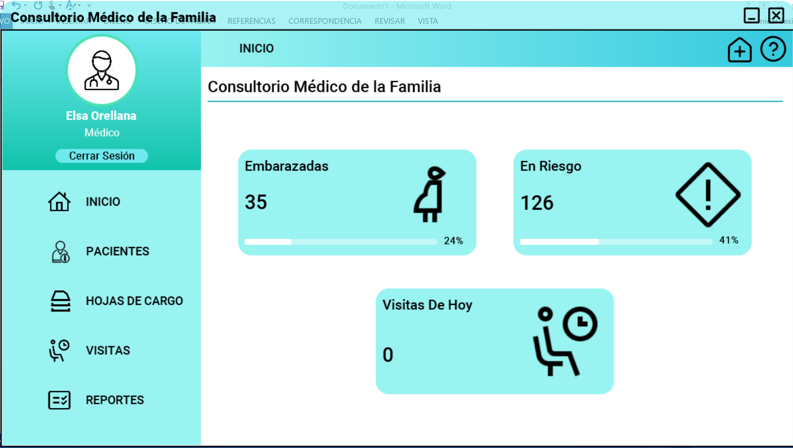
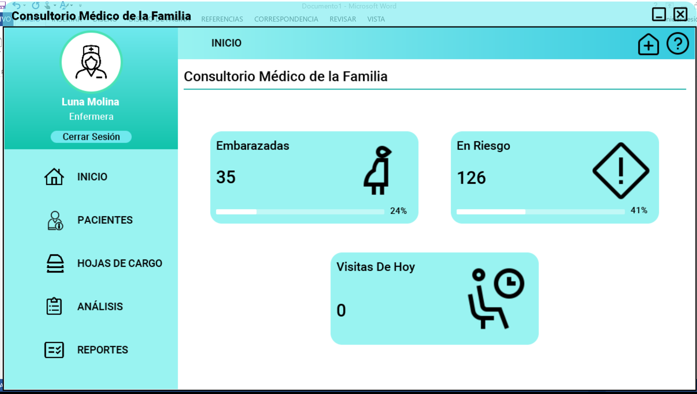
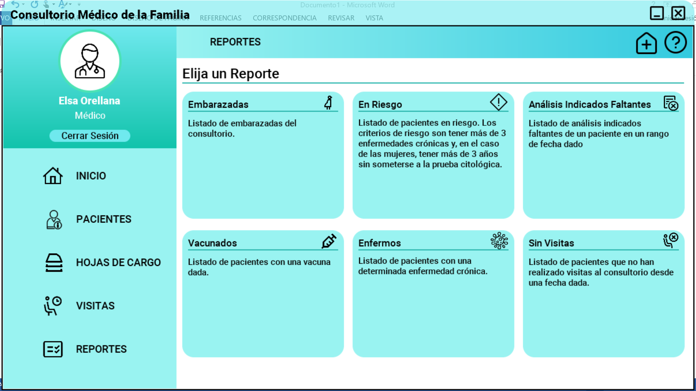

# Proyecto Dpoo

> [!NOTE]
> En la carpeta **/code** se encuentra el código del proyecto.
> En la carpeta **/executable** se encuentran los archivos ejecutables.
> En la carpeta **/docs** se encuentra la documentación del proyecto.

Proyecto de DPOO en Java | Java Swing sobre un sistema de para la administración de un Consultorio
Médico de la Familia.

Hecho por Eva Ercilia Vázquez García y Eduardo Alejandro González Martell.

## 💻 Características implementadas
- Piscina de datos masiva
- Inicialización de la aplicación automática y aleatoria
- Sistema de reportes
- Buscador en tiempo real por varios parámetros
- Interfaz intuitiva
- Dashboard_UI🎩 v1.0
- Se usó `launch4j` para crear un archivo binario ejecutable `.exe`

## 📸 Documentación general de la interfaz

### Pantalla de Carga
> 

### Autenticación
> [!TIP]
> Los usuarios válidos son:
> - **Médico:**
>   - `usuario`: medico
>   - `contraseña`: 1234
> - **Enfermera**
>   - `usuario`: medico
>   - `contraseña`: 1234
> 
> 

### Interfaz de Médico
> 

### Interfaz de Enfermera
> 

### Buscador de Pacientes
> 

### Información de Paciente
> 

### Selección de Reportes
> 

## 👾 Importación del proyecto
> [!IMPORTANT]
> Para importar correctamente el proyecto, debe tener como pre-requisito Java ~= 1.8

Los pasos son:
1. Clonar el repositorio o descargarlo.
2. Importar con Eclipse IDE o Intellij IDEA el proyecto en `/code/Proyecto Final CMF/`

## 🚀 Descarga del ejecutable
Para descargar el ejecutable siga el [siguiente enlace](https://github.com/EduardoProfe666/Proyecto-Dpoo/releases/latest)

Para ejecutarlo una vez descargado:
- Ejecutar el `.exe` o el `.jar`. En cualquiera de los 2 casos debe tener pre-instalado 
Java ~= 1.8